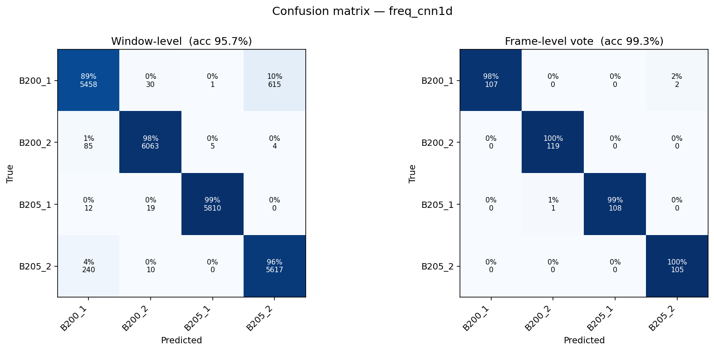
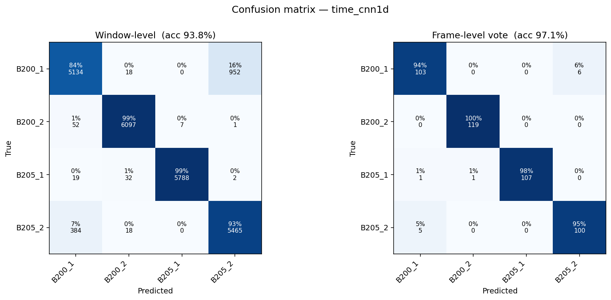
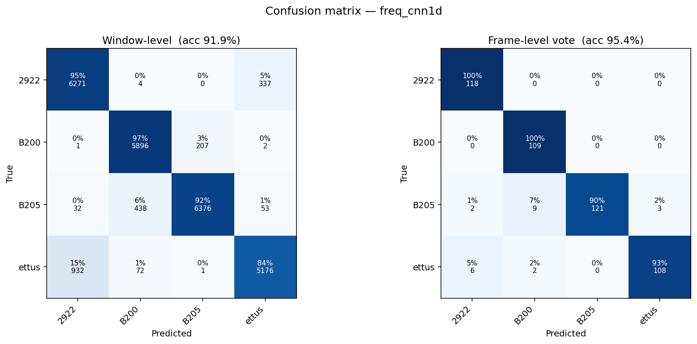
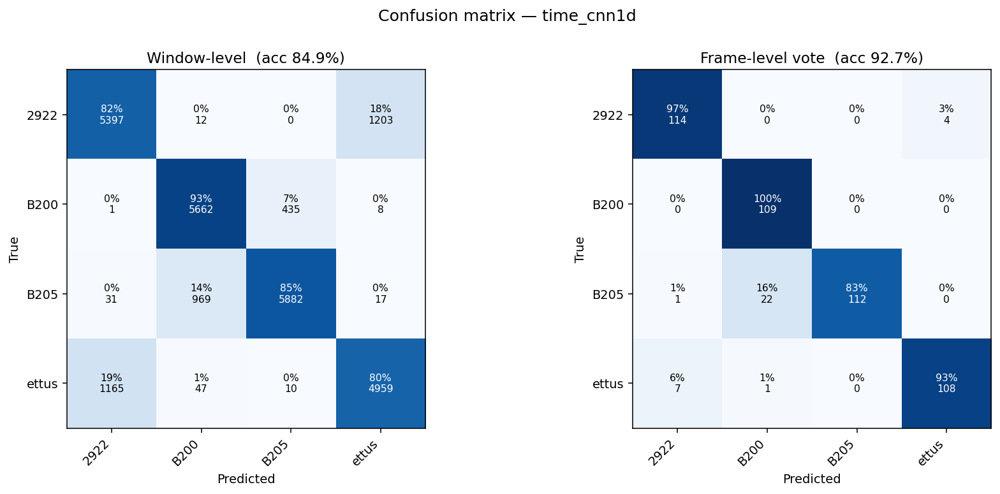

# Device Fingerprinting — Day1 & Day2 Datasets

**Author:** Hakim Lado **Date:** 2026-06-13

## Objective
Identify which transmitter sent a captured signal, using only the raw I/Q
waveform. Two datasets are evaluated independently:

- **Day1** — 4 devices: `B200_1`, `B200_2`, `B205_1`, `B205_2`
- **Day2** — 4 devices: `2922`, `B200`, `B205`, `ettus`

Each device is fingerprinted in **two signal representations** (time domain,
frequency domain), each with **two model families** (real 1D-CNN, complex-valued
CVNN) — four configurations per dataset.

## Method (brief)
- Captures: complex64 I/Q at **Fs = 5 MHz**, 4 devices × 3 runs (~35 s each).
- Signal bursts are energy-detected and sliced into **512-sample windows**, each
  power-normalized to unit average power.
- **Leakage-safe split:** train/validation on runs 1–2, **test on the unseen
  run 3**.
- *Frequency* representation = FFT of each window. The 1D-CNN uses the real/imag
  parts as two channels; the CVNN processes the complex signal directly.
- Reported metrics: **window-level** accuracy (per 512-sample slice) and
  **frame-level** accuracy (majority vote over all windows in one burst).

## Results

**Day1** (test set: 23,969 windows)

| Configuration | Window acc. | **Frame acc.** |
|---|:--:|:--:|
| Time-domain · 1D-CNN  | 93.8% | 97.1% |
| Time-domain · CVNN    | 89.9% | 94.3% |
| **Freq-domain · 1D-CNN** | **95.7%** | **99.3%** |
| Freq-domain · CVNN    | 94.9% | 98.6% |

**Day2** (test set: 25,798 windows)

| Configuration | Window acc. | **Frame acc.** |
|---|:--:|:--:|
| Time-domain · 1D-CNN  | 84.9% | 92.7% |
| Time-domain · CVNN    | 83.3% | 90.0% |
| **Freq-domain · 1D-CNN** | **91.9%** | **95.4%** |
| Freq-domain · CVNN    | 83.2% | 93.3% |

**Findings.** In both datasets the **frequency-domain 1D-CNN is the best model**
(99.3% on Day1, 95.4% on Day2, frame-level), and the frequency representation
outperforms the time domain across every configuration. Day1 is the easier set;
Day2 is harder, with its main residual error being `ettus` occasionally confused
with `2922`. Majority-voting over a burst consistently improves accuracy over the
per-window score.

---

## Confusion Matrices — Day1

**Best model — Freq-domain 1D-CNN**

**Time-domain 1D-CNN (for comparison)**

## Confusion Matrices — Day2

**Best model — Freq-domain 1D-CNN**

**Time-domain 1D-CNN (for comparison)**

*Each matrix shows window-level (left) and frame-level majority-vote (right)
results; cells give the row-normalized percentage and raw count. Confusion
matrices for the CVNN configurations are available in `figs/` and `figs/Day2/`.*
